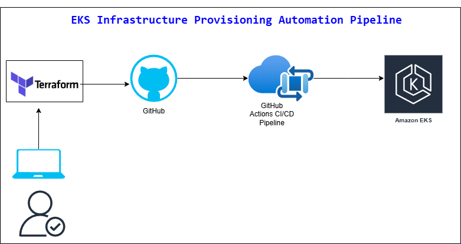

# eks-infra-cicd

deploy an EKS cluster using Terraform
### Deploy EKS Infrastructure with Terraform and GitHub Actions
```
Created resources in AWS Cloud using Terraform.
Resources provisioned:
    EKS cluster
    Node group 
    VPC
    subnets 

The Terraform state file will be stored in S3 bucket.
```


### Deploy Terraform code to AWS Cloud using GitHub Actions CI/CD pipeline
```
Created GitHub Actions CI/CD configuration file.
Tested and deployed code using the CI/CD pipeline.
```


### Tools used in the project
```
AWS Cloud
AWS CLI
Terraform
VSCode to write the Terraform code
Git/GitHub
GitHub Actions CI/CD
YAML for pipeline script
```


# App Deployment

### Install ArgoCD and configure ci/cd deployment
```
1. Install ArgoCD on EKS cluster
2. Log into UI of ArgoCD
3. Configure ArgoCD
4. Create app repo in GitHub
5. Cync app repo with ArgoCD
```


### Deploy app manually using the deployment manifest file
- Deploy flask/python app for resource monitoring
- App repo is eks-flask-app
- Create manifest file locally
- Create app on EKS cluster: kubectl apply -f deploy.yaml


### Deploy app using helm charts
- Download helm installation file
- Install helm and make sure it is in the path
- Create a custom helm chart: helm create webapp
- Update the chart.yaml for your application versions
- Update the values.yaml to hold the key:value pairs that will be used in templates folder
- Include all deployment, service, configmap, and other resource files in templates folder
- Update repeatitive names with variables whose values will be given in values.yaml
- Update all necessary configurations
- Install the desired application:
```
helm install <appName> <helm-chart-name>
```

# App Deployment Methods

### eks-go-app - using ArgoCD and CI/CD
https://github.com/Tgobezie/eks-go-app

### eks-flask-app - using local manifest file
https://github.com/Tgobezie/eks-flask-app

### helm-repo - using helm charts
https://github.com/Tgobezie/helm-repo


# Solution Diagram




# Author
```
Tee Gobezie
```
