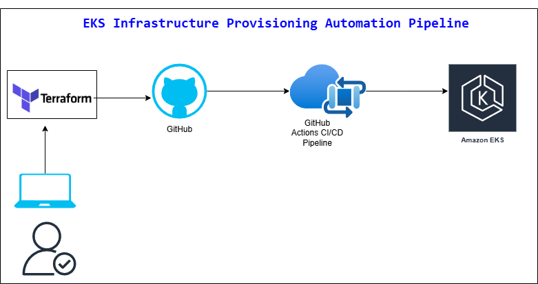

# eks-cluster


## EKS Infrastructure Provisioning Automation with Terraform and GitHub Actions
```
Created resources in AWS Cloud using Terraform.
Resources provisioned:
    EKS cluster
    Node group 
    VPC
    subnets 

The Terraform state file will be stored in S3 bucket.
```


## Deploy code to AWS Cloud using GitHub Actions CI/CD pipeline
```
Created GitHub Actions CI/CD configuration file.
Tested and deployed code using the CI/CD pipeline.
```


## Tools used in the project
```
AWS Cloud
AWS CLI
Terraform
VSCode to write the Terraform code
Git/GitHub
GitHub Actions CI/CD
YAML for pipeline script
```


## Solution Diagram



## Author
```
Tee Gobezie
```